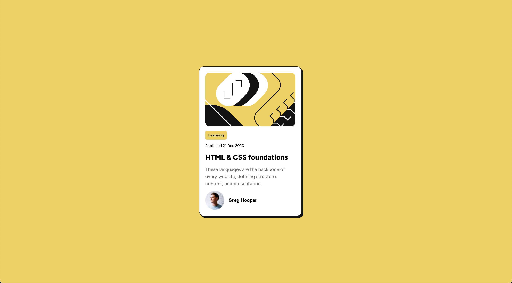

# Frontend Mentor - Blog preview card solution

This is a solution to the [Blog preview card challenge on Frontend Mentor](https://www.frontendmentor.io/challenges/blog-preview-card-ckPaj01IcS). Frontend Mentor challenges help you improve your coding skills by building realistic projects.

## Table of contents

- [Overview](#overview)
  - [The challenge](#the-challenge)
  - [Screenshot](#screenshot)
  - [Links](#links)
- [My process](#my-process)
  - [Built with](#built-with)
  - [What I learned](#what-i-learned)
  - [Continued development](#continued-development)
  - [Useful resources](#useful-resources)
- [Author](#author)
- [Acknowledgments](#acknowledgments)

**Note: Delete this note and update the table of contents based on what sections you keep.**

## Overview

### The challenge

Users should be able to:

- See hover and focus states for all interactive elements on the page

### Screenshot



### Links

- Solution URL: [Add solution URL here](https://your-solution-url.com)
- Live Site URL: [Add live site URL here](https://your-live-site-url.com)

## My process

### Built with

- Semantic HTML5 markup
- CSS custom properties
- Flexbox
- CSS Grid
- Mobile-first workflow

### What I learned

I learned more about responsive design, specifically how to combine width and max-width. Previously, I had an issue where the card element would take up the full viewport width on smaller screens. By setting width: 90%, I was able to create the necessary space around the element. I also made sure to primarily use rem units instead of px to ensure the design remains scalable if a user changes their browser's default font size.

```css
.blog-card {
  width: 90%;
  max-width: 24rem;
}
```

### Continued development

I want to continue improving my skills and knowledge in creating responsive designs and choosing the right units for elements.

## Author

- Github - [Zupi-HR](https://github.com/Zupi-HR)
- Frontend Mentor - [@Zupi-HR](https://www.frontendmentor.io/profile/Zupi-HR)
